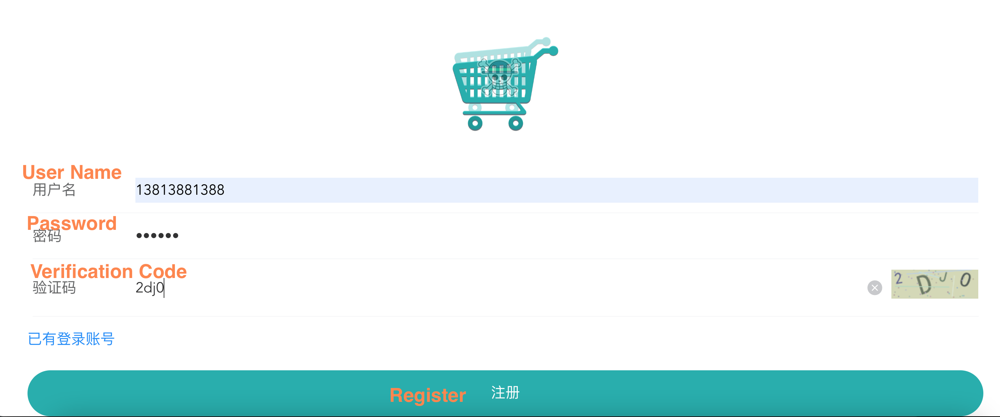

# newbee_api_test

**newbee_api_test** is an API test project of opensource project [newbee-mall-api](https://github.com/newbee-ltd/newbee-mall-api)

### How to get account 
To get the account necessary to test, please go to [mall website](http://47.99.134.126:5008/#/login)


**UserName**: 13 digits starting with 13,14,17 or 18, such as `14812341234`,`18900001111`

**Password**: A string of numbers and letters.

### How to run test cases

- Environment: Python 3.11

- Under project directory run command
```shell
 pytest --login-name=YourUserName --password=YourPassword --api-base-url=http://backend-api-01.newbee.ltd/ test/
```


